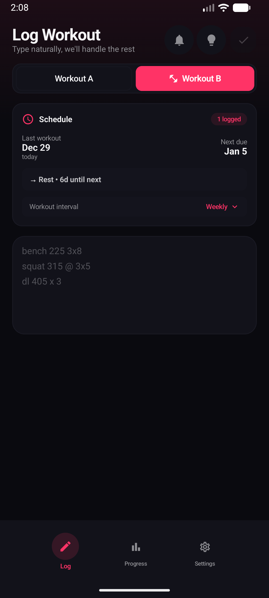
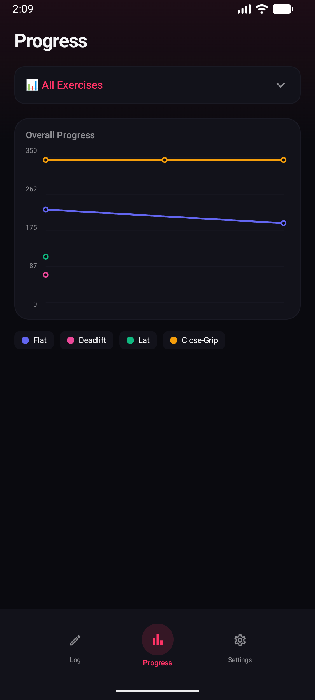
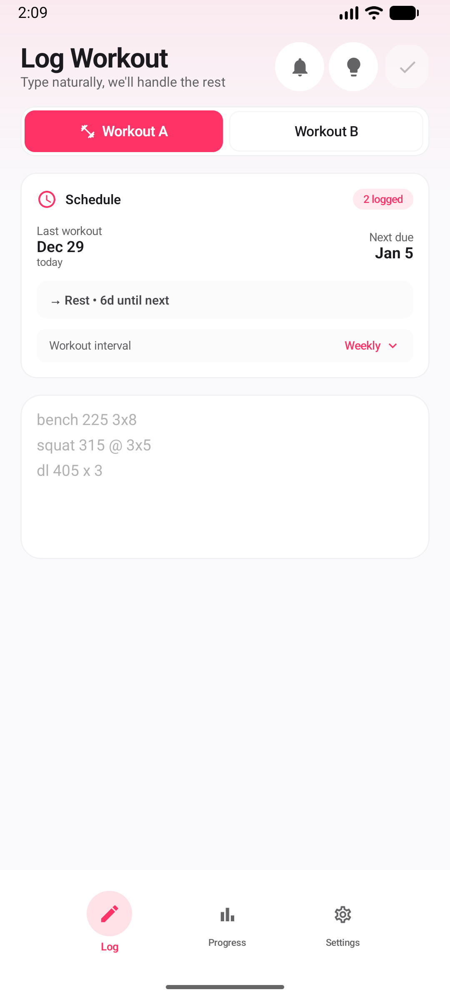

# MentzerTracker

A flexible workout logging app for Android, with optional A/B workout tracking inspired by Mike Mentzer's High Intensity Training.

## Screenshots

<p align="center">
  
  
  
</p>

## Features

### Logging
- **Natural language input** - Type "bench 225 x 8" or "squat 315 3x5" and it parses automatically
- **70+ built-in exercises** covering chest, back, shoulders, legs, arms, and core
- **200+ aliases** - "bench", "flat bench", "bb bench" all work for bench press
- **Smart suggestions** - Adapts to what you're typing

### Tracking
- **Progress charts** - Line graphs showing weight progression over time
- **"All" view** - See all exercises on one chart
- **Date editing** - Fix mistakes on past workouts
- **Session history** - Scroll through recent workouts per exercise

### Scheduling
- **Flexible intervals** - Daily, weekly, or custom (every X days)
- **Simple schedule card** - Shows last workout and when next is due
- **Optional A/B tracking** - Traditional split if you want it
- **Notifications** - Customizable workout reminders

### Other
- Light & dark themes
- Backup & restore (JSON export)
- No account required - all data stored locally

## Requirements

- **Android 10 (API 29)** or higher
- ~15 MB storage

## Building from Source

### Prerequisites
- Android Studio Hedgehog (2023.1.1) or newer
- JDK 17
- Android SDK with API 36

### Steps

```bash
# Clone the repository
git clone https://github.com/vincentlarkin/MentzerTracker.git
cd MentzerTracker

# Open in Android Studio and sync Gradle
# Or build from command line:
./gradlew assembleDebug
```

The APK will be at `app/build/outputs/apk/debug/app-debug.apk`

## Tech Stack

- **Kotlin** with Jetpack Compose
- **Material 3** design system
- **WorkManager** for notifications
- **Gson** for JSON serialization
- **SharedPreferences** for local storage

## Project Structure

```
app/src/main/java/com/example/mentzertracker/
├── novanotes/           # Main UI screens
│   ├── NovaHomeScreen.kt      # Logging interface
│   ├── NovaBuilderScreen.kt   # Workout configuration
│   └── WorkoutParser.kt       # Natural language parsing
├── NovaProgressScreen.kt      # Charts and history
├── NovaSettingsScreen.kt      # App settings
├── WorkoutData.kt             # Exercise definitions
├── NotificationHelper.kt      # Reminder scheduling
└── legacy/                    # Archived v1 code
```

## License

Personal project - feel free to fork and modify for your own use.
