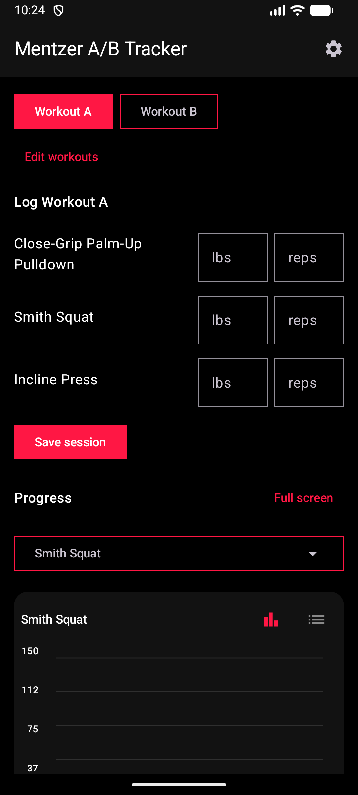
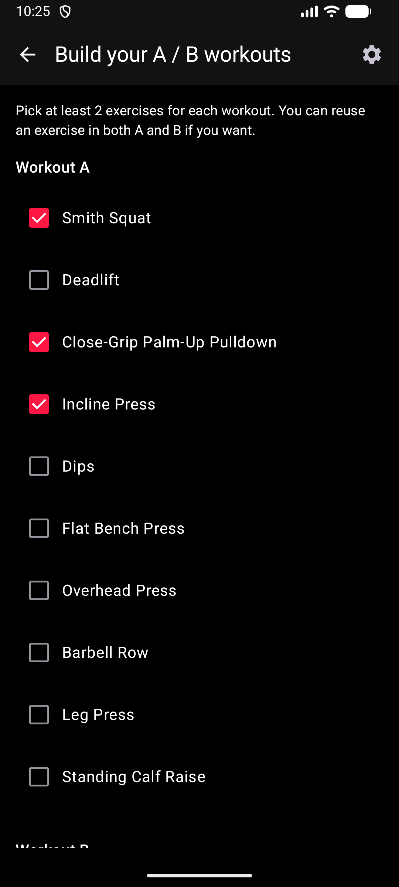
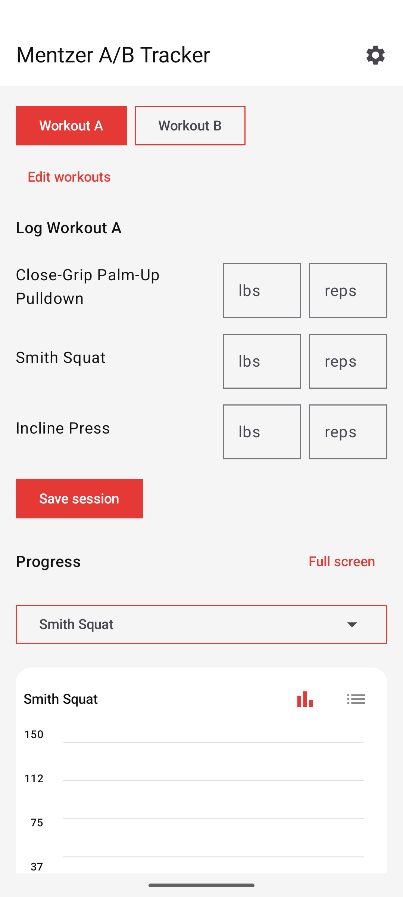
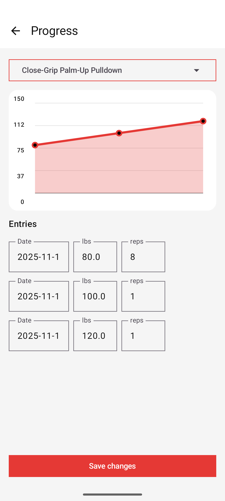

# MentzerTracker

MentzerTracker is a simple Android app for planning and logging Mike Mentzer style A/B workouts. Built this for personal workout usage.

## Features
- Quick logging for weight and reps
- Optional per-session notes so you remember how a workout felt
- Light and dark theme
- Data reset option for a fresh start
- Customizable workout notifications (Daily, Weekly, or custom intervals) to keep you on track.
- Smart workout logic notifications (tells you if it's time for Workout A or B).

## Screenshots

<p align="center">
  
  
</p>
<p align="center">
  
  
</p>

## Code Layout
- `MainActivity.kt` – wires together theme, splash/builder/tracker flow, and ties persistence to the UI.
- `SplashScreen.kt` – welcome screen with backup import and settings shortcut.
- `TemplateSelector.kt` – simple A/B workout picker and “Edit workouts” entry point.
- `LogWorkoutSection.kt` – input surface to record sets for the selected template.
- `ProgressSection.kt` – compact per‑exercise chart/list plus dropdown/tooltip helpers.
- `FullProgressScreen.kt` – full-screen progress editor with date picker, delete/save controls.
- `ui/settings/SettingsScreen.kt` – appearance, backup/export, and debug/notification tools.
- `NotificationSettingsDialog.kt` & `NotificationHelper.kt` – reminder preferences, scheduling, and test notifications.
- `WorkoutReminderWorker.kt` – WorkManager worker that fires the scheduled reminder notification.

## Building

1. **Clone the repo**
   ```bash
   git clone https://github.com/<your-org>/MentzerTracker.git
   cd MentzerTracker
   ```
2. **Open in Android Studio** (Giraffe or newer recommended).
3. **Sync & Build** – Android Studio will download dependencies via Gradle.
4. **Run** on an emulator or physical device running Android 11.0 or higher.
