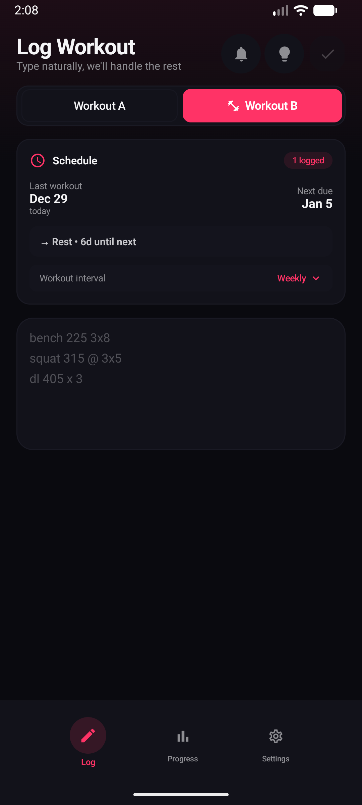
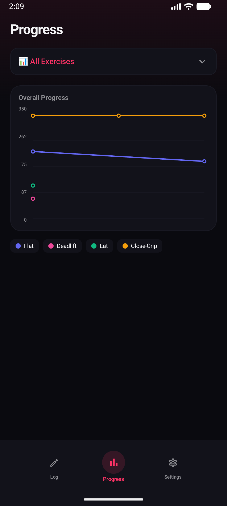
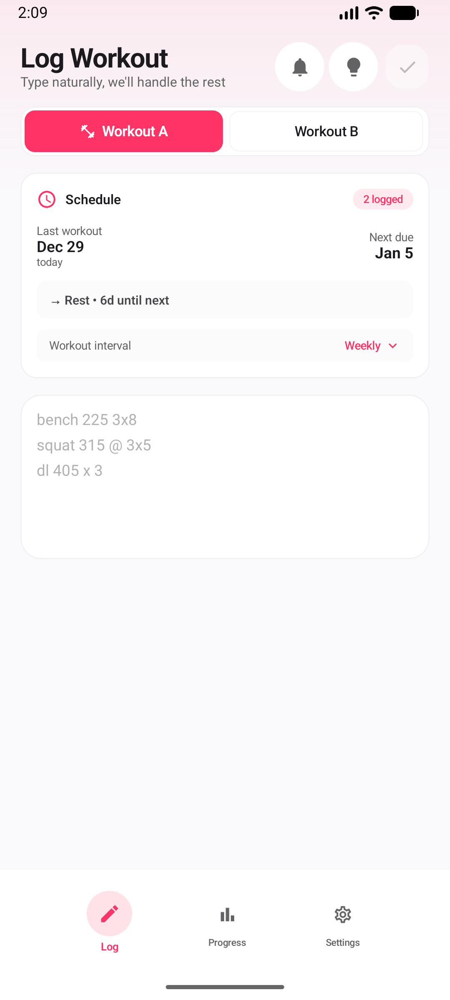

# MentzerTracker

A flexible Android workout logger focused on fast, natural entry for both strength and cardio sessions.

## Screenshots

<p align="center">
  
  
  
</p>

## Features

### Logging
- **Natural language input** - Type `bench 225 x 8`, `squat 315 3x5`, `cable crunch 80 x 15`, or `plank 60 sec`
- **Cardio-friendly logging** - Log treadmill and elliptical with time, distance, calories, steps, or a mix
- **120+ built-in exercises** covering free weights, machines, core, cardio, and common Planet Fitness equipment
- **260+ aliases** - Shorthand and common variants like `bench`, `crunchs`, and `eleptical` work
- **Better core support** - Reps-only and hold-based ab work like crunches, sit-ups, leg raises, and planks parse cleanly
- **Smart suggestions** - Adapts to what you're typing

### Tracking
- **Progress charts** - Line graphs showing weight progression over time for strength movements
- **"All" view** - See all exercises on one chart
- **By-date history** - Review full workouts grouped by day, including cardio summaries
- **Date editing** - Fix mistakes on past workouts
- **Session history** - Scroll through recent workouts per exercise

### Scheduling
- **Flexible intervals** - Daily, weekly, or custom (every X days)
- **Simple schedule card** - Shows last workout and when next is due
- **Simple scheduling** - Set intervals for reminders and recovery
- **Notifications** - Customizable workout reminders

### Other
- Light & dark themes
- Backup & restore (JSON export)
- No account required - all data stored locally

## Example Inputs

```text
bench 225 3x8
cable crunch 80 x 15
crunchs 25
plank 60 sec
treadmill 20 min 250 cal
elliptical 2.5 mi 30 min 4500 steps
```

## Requirements

- **Android 10 (API 29)** or higher
- ~15 MB storage

## Building from Source

### Prerequisites
- Android Studio Hedgehog (2023.1.1) or newer
- JDK 17
- Android SDK with API 36

### Steps

```bash
# Clone the repository
git clone https://github.com/vincentlarkin/MentzerTracker.git
cd MentzerTracker

# Open in Android Studio and sync Gradle
# Or build from command line:
./gradlew assembleDebug
```

The APK will be at `app/build/outputs/apk/debug/app-debug.apk`

## Tech Stack

- **Kotlin** with Jetpack Compose
- **Material 3** design system
- **WorkManager** for notifications
- **Gson** for JSON serialization
- **SharedPreferences** for local storage

## Project Structure

```text
app/src/main/java/com/example/mentzertracker/
|-- novanotes/                # Main UI screens
|   |-- NovaHomeScreen.kt     # Main logging interface
|   |-- NovaBuilderScreen.kt  # Exercise/workout reference
|   |-- NovaNotesScreen.kt    # Alternate notes-style logger
|   `-- WorkoutParser.kt      # Natural language parsing
|-- NovaProgressScreen.kt     # Charts and history
|-- NovaSettingsScreen.kt     # App settings
|-- WorkoutData.kt            # Exercise definitions and tracking models
`-- NotificationHelper.kt     # Reminder scheduling
```

## License

Personal project - feel free to fork and modify for your own use.
